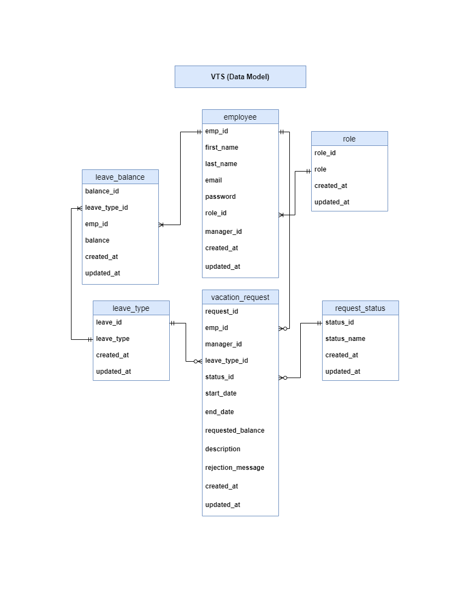

# **Vacation Tracking System (VTS)**

## **Table of Contents**

1. [Overview](#overview)
   - [Domain Problem](#domain-problem)
   - [Vision](#vision)
2. [Functional Requirements](#functional-requirements)
3. [Non-Functional Requirements](#non-functional-requirements)
4. [Constraints](#constraints)
5. [Actors](#actors)
6. [Domain Knowledge](#domain-knowledge)
7. [Use Cases](#use-cases)
8. [Data Model](#data-model)

---

## **Overview**

### **Domain Problem**

Historically, vacation time approvals required a manager's authorization followed by validation from an HR clerk, resulting in a manual process that often took several days.

### **Vision**

The Vacation Tracking System (VTS) empowers employees to manage their own vacation time, sick leave, and personal time off in alignment with company and facility-specific policies.

**Key Objectives:**

- Streamline HR department processes by reducing manual intervention.
- Minimize non-core business-related management tasks.
- Foster employee empowerment by giving them control over their leave management.

---

## **Functional Requirements**

1. **Rules-Based Leave Validation:**  
   Implement a flexible rules engine for validating and verifying leave requests.

2. **Managerial Oversight:**  
   Allow optional manager approval for leave requests.

3. **Comprehensive Leave History:**

   - Provide access to requests from the past calendar year.
   - Support future requests up to 18 months ahead.

4. **Email Notifications:**  
   Use email to:

   - Request manager approvals.
   - Notify employees of request status changes.

5. **Infrastructure Integration:**

   - Leverage existing hardware and middleware.
   - Integrate with the company’s intranet portal, utilizing single-sign-on (SSO) for authentication.

6. **Transaction Logging:**  
   Log all system transactions for auditing purposes.

7. **Administrative Overrides:**  
   Enable HR and system administrators to override actions, with detailed logging for transparency.

8. **Managerial Granting:**  
   Allow managers to directly award personal leave time, adhering to system-set limits.

9. **Web Service Interface:**  
   Provide APIs to query an employee's vacation request summary.

10. **Legacy System Integration:**  
    Interface with HR legacy systems to fetch employee information and updates.

---

## **Non-Functional Requirements**

- The system must use existing hardware and middleware
- The system must be easy to use.

---

## **Constraints**

- Legacy Hardware
- Single-sign-on
- User experience
- Integrations with the portal

---

## **Actors**

1. **Employee**: Initiates leave requests.
2. **Manager**: Approves or denies leave requests.
3. **Clerk**: Validates leave requests per HR policies.
4. **System Admin**: Manages overrides and system maintenance.

---

## **Domain Knowledge**

- All employees work 8-hour days.
- Leave requests are subject to both company-wide and location-specific policies.
- HR defines and owns all vacation request validation rules.

---

## **Use Cases**

- [Manage Time](./use-cases/manage-time/)
   - [Vacation Request](./use-cases/manage-time/vacation-request.md)
   - [Edit Vacation Request](./use-cases/manage-time/edit-vacation-request.md)
   - [Withdraw Vacation Request](./use-cases/manage-time/withdraw-vacation-request.md)
   - [Cancel Vacation Request](./use-cases/manage-time/cancel-vacation-request.md)

## **Data Model**

