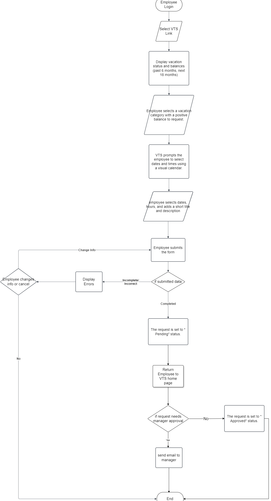
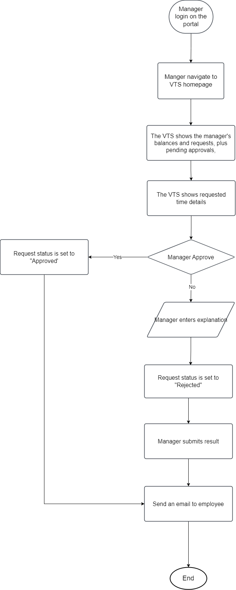
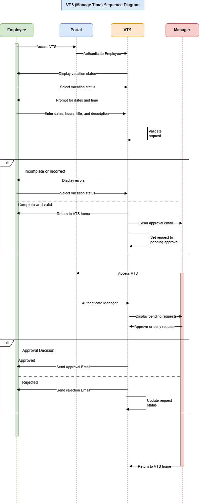

# **Vacation Tracking System (VTS)**

## **Table of Contents**

1. [Overview](#overview)
   - [Domain Problem](#domain-problem)
   - [Vision](#vision)
2. [Functional Requirements](#functional-requirements)
3. [Non-Functional Requirements](#non-functional-requirements)
4. [Constraints](#constraints)
5. [Actors](#actors)
6. [Domain Knowledge](#domain-knowledge)
7. [Entities](#entities)
8. [Pseudo-Code: Manage Time Use Case](#pseudo-code-manage-time-use-case)

---

## **Overview**

### **Domain Problem**

Historically, vacation time approvals required a manager's authorization followed by validation from an HR clerk, resulting in a manual process that often took several days.

### **Vision**

The Vacation Tracking System (VTS) empowers employees to manage their own vacation time, sick leave, and personal time off in alignment with company and facility-specific policies.

**Key Objectives:**

- Streamline HR department processes by reducing manual intervention.
- Minimize non-core business-related management tasks.
- Foster employee empowerment by giving them control over their leave management.

---

## **Functional Requirements**

1. **Rules-Based Leave Validation:**  
   Implement a flexible rules engine for validating and verifying leave requests.

2. **Managerial Oversight:**  
   Allow optional manager approval for leave requests.

3. **Comprehensive Leave History:**

   - Provide access to requests from the past calendar year.
   - Support future requests up to 18 months ahead.

4. **Email Notifications:**  
   Use email to:

   - Request manager approvals.
   - Notify employees of request status changes.

5. **Infrastructure Integration:**

   - Leverage existing hardware and middleware.
   - Integrate with the company’s intranet portal, utilizing single-sign-on (SSO) for authentication.

6. **Transaction Logging:**  
   Log all system transactions for auditing purposes.

7. **Administrative Overrides:**  
   Enable HR and system administrators to override actions, with detailed logging for transparency.

8. **Managerial Granting:**  
   Allow managers to directly award personal leave time, adhering to system-set limits.

9. **Web Service Interface:**  
   Provide APIs to query an employee's vacation request summary.

10. **Legacy System Integration:**  
    Interface with HR legacy systems to fetch employee information and updates.

---

## **Non-Functional Requirements**

- System performance should ensure responsiveness under high concurrent usage.
- Security measures must protect sensitive employee data, including role-based access control.
- High availability to minimize downtime and ensure reliable access.

---

## **Constraints**

- The system must be easy to use, ensuring adoption by all employees regardless of technical proficiency.

---

## **Actors**

1. **Employee**: Initiates leave requests.
2. **Manager**: Approves or denies leave requests.
3. **Clerk**: Validates leave requests per HR policies.
4. **System Admin**: Manages overrides and system maintenance.

---

## **Domain Knowledge**

- All employees work 8-hour days.
- Leave requests are subject to both company-wide and location-specific policies.
- HR defines and owns all vacation request validation rules.

---

## **Entities**

1. **Employee**

2. **Location**

3. **Category**

4. **Request**

5. **Grant**

6. **Restriction**

## Visual Representations

#### **Flowchart: Main System Flow**

The following flowcharts illustrate the main flow of the Vacation Tracking System (VTS), showcasing the process from request submission to approval and notification.

#### **Sequence Diagram**

The sequence diagram below details the interaction between system components and actors during the vacation request and approval process.

---

## **Pseudo-Code: Manage Time Use Case**

    BEGIN ManageTimeUseCase
      INPUT: Employee credentials (authenticated via portal)

      STEP 1: Display VTS link on the intranet portal.
      STEP 2: On link selection, fetch the employee's:
          - Current vacation requests (past 6 months).
          - Vacation balances (up to 18 months in the future).

      STEP 3: If employee opts to create a new request:
          3.1: Prompt for vacation category with a positive balance.
          3.2: Provide a calendar for date(s) selection.
          3.3: Input:
              - Desired dates.
              - Hours per date (e.g., half-day = 4 hours).
              - Title and description (short summary).

      STEP 4: Validate inputs:
          - If incomplete or invalid:
              4.1: Redisplay form with highlighted errors.
              4.2: Allow corrections or cancelation.
          - If valid:
              4.3: Submit the request.
              4.4: Redirect employee to VTS home page.

      STEP 5: Notify manager(s) via email (if approval required).

      STEP 6: Manager Approval Process:
          6.1: Manager logs into the VTS via email link or intranet portal.
          6.2: Authenticate credentials (if required).
          6.3: Display manager's dashboard with:
              - Manager's vacation requests.
              - Pending approval requests for subordinates.

          FOR each pending request:
              - Display request details.
              - Prompt for approval or rejection:
                  - If rejected: Manager must provide an explanation.
                  - Update request state (approved/rejected).
                  - Notify employee of the decision via email.

          6.4: Allow manager to:
              - Approve more requests.
              - Submit a new request.
              - Exit the application.
    END ManageTimeUseCase
