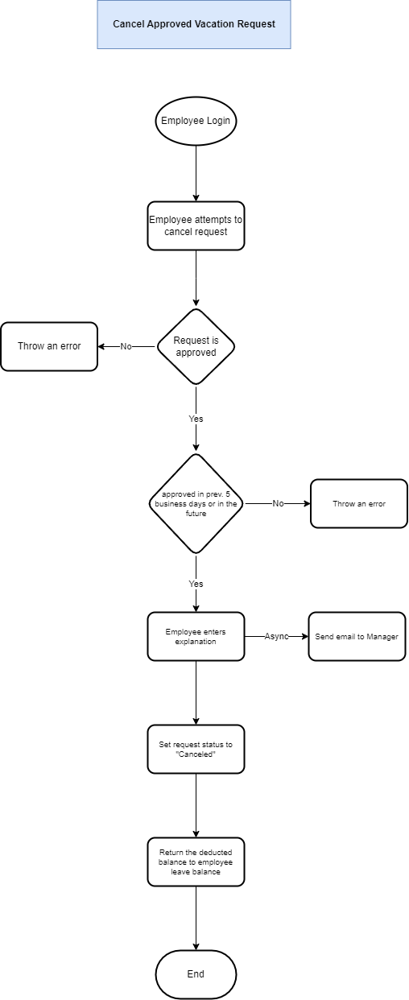
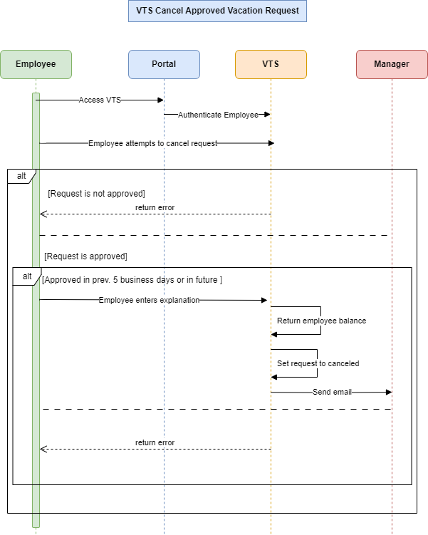

# Cancel Approved Vacation Request

**Goal:** Cancel an approved vacation time request.

**Preconditions:**

- The request is approved and scheduled for the future or within the last 5 business days.
- Main flow preconditions apply.

**Steps:**

1. Employee accesses the VTS home page via the intranet portal.
2. VTS displays vacation request summaries and balances.
3. Employee selects a future or recent past approved request to cancel.
4. Employee confirms the cancellation (and provides an explanation for past requests).
5. System notifies the manager via email, updates the request status to "Canceled," and restores used vacation time to the balance.
6. Employee is returned to the VTS home page with updated summaries.

---

## **Flowchart**



---

## **Sequence Diagram**



---

## **Pseudo-Code: Cancel Vacation Request**

```
function cancelApprovedVacationRequest(employeeId, requestId, explanation):
    if not employeeLogin(employeeId):
        throwError("Employee not logged in")

    request = getVacationRequest(requestId)

    if request.status != "Approved":
        throwError("Request is not approved")

    currentDate = getCurrentDate()
    approvalDate = request.approvalDate

    if approvalDate < currentDate - 5 or approvalDate > currentDate:
        throwError("Request cannot be canceled outside allowed period")


    request.status = "Canceled"
    updateVacationRequest(request)

    sendEmailToManager(employeeId, requestId, explanation)


    returnLeaveBalanceToEmployee(employeeId, request.deductedDays)

    return "Request canceled successfully"
```
