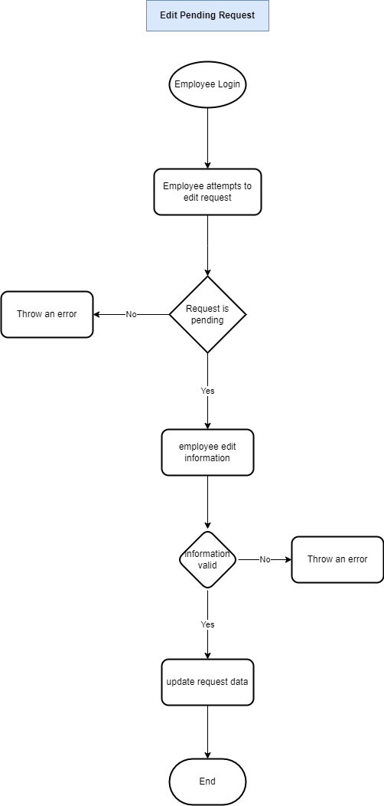
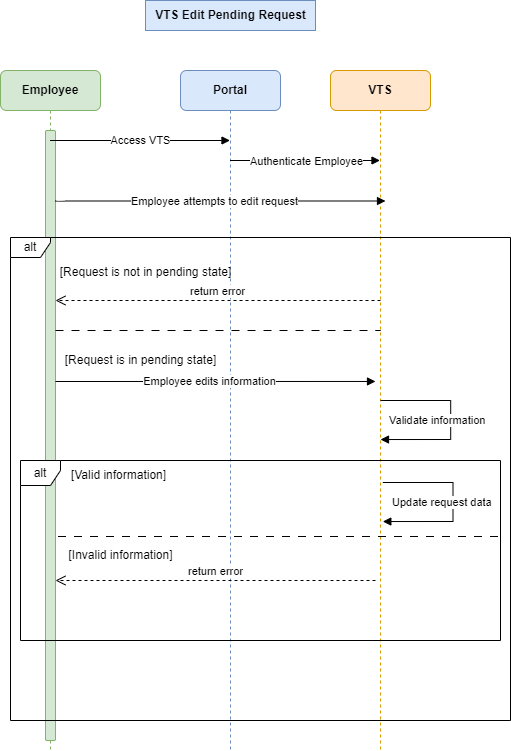

### Edit Pending Request

**Goal:** Edit the title, description, or dates of a pending vacation request.

**Preconditions:**

- The request is pending manager approval.
- Main flow preconditions apply.

**Steps:**

1. Employee accesses the VTS home page via the intranet portal.
2. VTS displays vacation request summaries and balances.
3. Employee selects a pending request to edit.
4. VTS displays an editable view of the request.
5. Employee updates the title, description, or dates and submits changes.
   - If errors occur, VTS highlights and explains issues for correction.
6. Employee can also choose to withdraw the request.
   - VTS prompts for confirmation before withdrawing.
7. Changes are saved, and the employee is returned to the updated VTS home page.

---

## **Flowchart**



---

## **Sequence Diagram**



---

## **Pseudo-Code: Edit Vacation Request**

```
function editPendingVacationRequest(employeeId, requestId, newRequestData):
    if not employeeLogin(employeeId):
        throwError("Employee not logged in")

    request = getVacationRequest(requestId)

    if request.status != "Pending":
        throwError("Request is not pending")

    if not isValidRequestData(newRequestData):
        throwError("Invalid request data")

    updateVacationRequestData(requestId, newRequestData)

    return "Request updated successfully"
```
