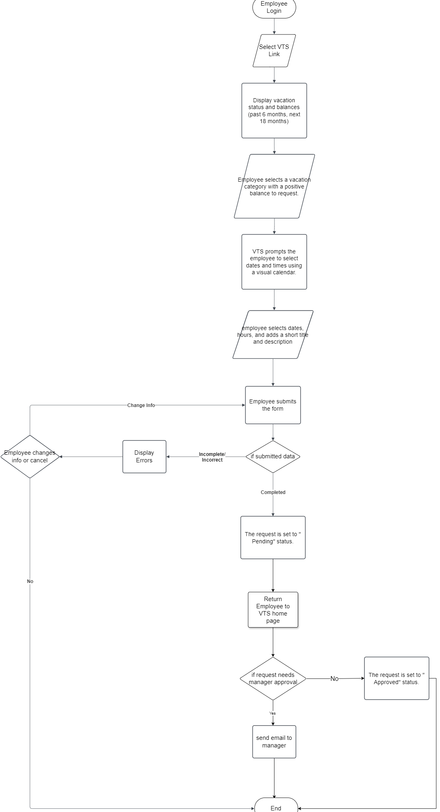
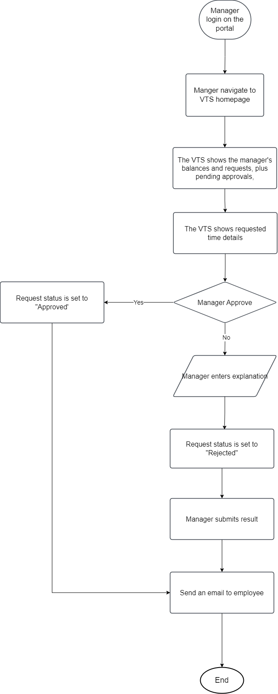
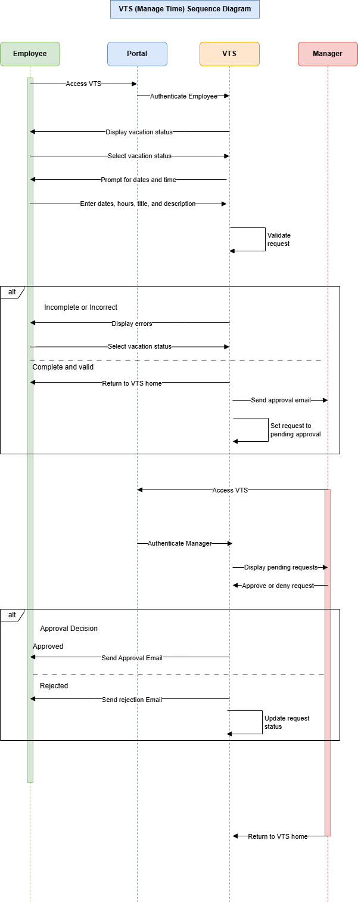

# Create Vacation Request

**Goal:** Submit a vacation time request.

**Preconditions**

- The employee is authenticated and identified in the system.
- The employee has privileges to manage their vacation time.

**Steps**

1. The employee accesses the Vacation Time System (VTS) via a link in the intranet portal.
2. VTS displays the employee’s vacation time requests and balances for the past 6 months and up to 18 months ahead.
3. The employee selects a vacation category with a positive balance to create a new request.
4. The employee inputs the desired dates, hours, and optional details (title/description) via a visual calendar.
5. After entering the information, the employee submits the request.
6. If the data is incomplete or invalid, errors are highlighted for correction.
7. The employee can edit or cancel the request.
8. Upon successful submission:
   - The employee returns to the VTS homepage.
   - If approval is required, the system sends an email to the relevant manager(s).
   - The request status is updated to "Pending Approval."
9. The manager reviews pending requests by accessing the VTS through the portal or an email link.
10. The manager views details and approves or rejects the request, providing an explanation if rejected.
11. The system notifies the employee of the decision via email.

---

## **Flowchart**

---

## **Sequence Diagram**

---

### **Pseudo-Code: Manage Time Use Case**

    BEGIN ManageTimeUseCase
      INPUT: Employee credentials (authenticated via portal)

      STEP 1: Display VTS link on the intranet portal.
      STEP 2: On link selection, fetch the employee's:
          - Current vacation requests (past 6 months).
          - Vacation balances (up to 18 months in the future).

      STEP 3: If employee opts to create a new request:
          3.1: Prompt for vacation category with a positive balance.
          3.2: Provide a calendar for date(s) selection.
          3.3: Input:
              - Desired dates.
              - Hours per date (e.g., half-day = 4 hours).
              - Title and description (short summary).

      STEP 4: Validate inputs:
          - If incomplete or invalid:
              4.1: Redisplay form with highlighted errors.
              4.2: Allow corrections or cancelation.
          - If valid:
              4.3: Submit the request.
              4.4: Redirect employee to VTS home page.

      STEP 5: Notify manager(s) via email (if approval required).

      STEP 6: Manager Approval Process:
          6.1: Manager logs into the VTS via email link or intranet portal.
          6.2: Authenticate credentials (if required).
          6.3: Display manager's dashboard with:
              - Manager's vacation requests.
              - Pending approval requests for subordinates.

          FOR each pending request:
              - Display request details.
              - Prompt for approval or rejection:
                  - If rejected: Manager must provide an explanation.
                  - Update request state (approved/rejected).
                  - Notify employee of the decision via email.

          6.4: Allow manager to:
              - Approve more requests.
              - Submit a new request.
              - Exit the application.
    END ManageTimeUseCase
