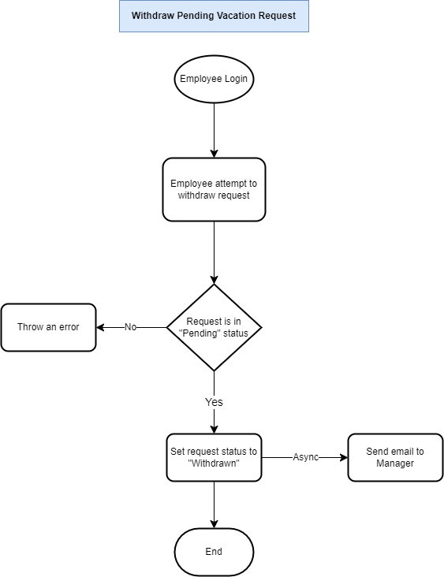
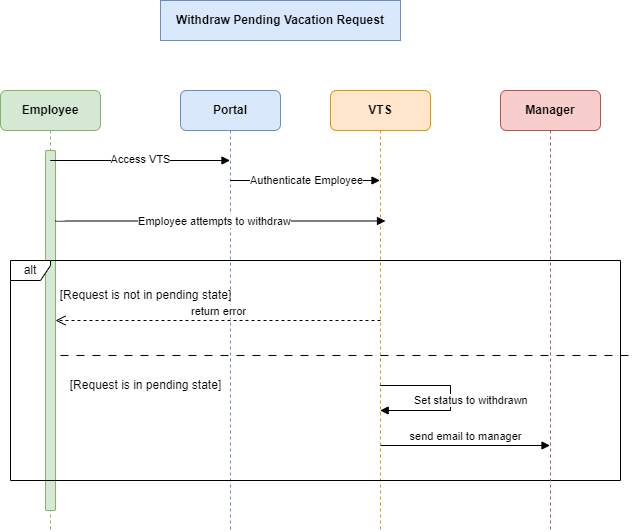

# Withdraw Vacation Request

**Goal:** Withdraw a pending vacation time request.

**Preconditions:**

- The vacation request is pending manager approval.
- Main flow preconditions apply.

**Steps:**

1. Employee accesses the VTS home page via the intranet portal.
2. VTS displays vacation request summaries and balances.
3. Employee selects a pending request to withdraw.
4. Employee confirms the withdrawal.
5. Request is removed from the manager’s pending approvals.
6. System sends a notification email to the manager.
7. Request status is updated to "Withdrawn."

---

## **Flowchart**



---

## **Sequence Diagram**


---

## **Pseudo-Code: Withdraw Vacation Request**

```
function withdrawVacationRequest(employeeId, requestId, newRequestData):
    if not employeeLogin(employeeId):
        throwError("Employee not logged in")

    request = getVacationRequest(requestId)

    if request.status != "Pending":
        throwError("Request is not pending")

    request.status = "Withdrawn"
    updateVacationRequest(request)

    sendEmailToManager(employeeId, requestId)

    return "Request withdrawn successfully"
```
